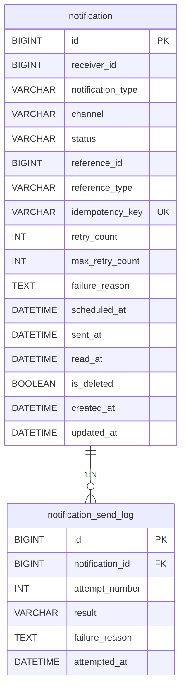

# be-c-notification-system

## 목차

1. [프로젝트 개요](#1-프로젝트-개요)
2. [기술 스택](#2-기술-스택)
3. [실행 방법](#3-실행-방법)
4. [요구사항 해석 및 가정](#4-요구사항-해석-및-가정)
5. [비동기 처리 구조 및 재시도 정책](#5-비동기-처리-구조-및-재시도-정책)
6. [설계 결정과 이유](#6-설계-결정과-이유)
7. [미구현 / 제약사항](#7-미구현--제약사항)
8. [AI 활용 범위](#8-ai-활용-범위)
9. [API 목록 및 예시](#9-api-목록-및-예시)
10. [데이터 모델 설명](#10-데이터-모델-설명)
11. [테스트 실행 방법](#11-테스트-실행-방법)

---

## 1. 프로젝트 개요

**과제 C — 알림 발송 시스템** 프로젝트입니다.

수강 신청 완료, 결제 확정, 강의 D-1 알림, 취소 등 업무 이벤트가 발생했을 때 **이메일 또는 인앱**으로 알림을 보내야 하는 상황을 가정합니다.

---

## 2. 기술 스택

- Java 21
- Spring Boot 3.4.4
- Spring Web, Validation, Spring Data JPA (Hibernate)
- MySQL 8 — 로컬 또는 Docker
- H2 — `test` 프로파일(테스트)
- springdoc-openapi 2.8.8 — Swagger UI
- Docker Compose — MySQL + 앱, 멀티 스테이지 `Dockerfile`로 이미지 빌드
- Gradle — 로컬 또는 Docker 빌드 스테이지에서 `bootJar`

---

## 3. 실행 방법

Compose는 `DB_NAME`, `DB_ROOT_PASSWORD` 등을 읽습니다. `dev.env`에 두고 **`--env-file`** 로 넘기면 됩니다.

### Docker Compose

```bash
docker compose --env-file dev.env up --build
```

- **API**: http://localhost:8080
- **Swagger UI**: http://localhost:8080/swagger-ui.html

### 로컬 실행

```bash
./gradlew bootRun
```

MySQL만 Docker로 쓸 때:

```bash
docker compose --env-file dev.env up -d mysql
```

---

## 4. 요구사항 해석 및 가정

### 요구사항 해석 

1. **알림 처리 실패가 비즈니스 트랜잭션에 영향 없음**
   - DB에 알림을 먼저 저장·커밋한 뒤, **`AFTER_COMMIT` + `@Async`** 로 발송 처리를 분리
2. **실패 사유는 기록되어야 함**
   - 실패는 **`failure_reason`**, **`retry_count`**, **`notification_send_log`** 로 남기고 추적
3. **중복 발송 방지(동시 요청 포함)**
   - 멱등 키와 **`UNIQUE(idempotency_key)`** 로 저장 단계에서 막고, 처리 단계에서는 **`compareAndSwap`** 으로 동시에 같은 건이 발송되지 않도록 구현
4. **비동기 + 브로커 없이 운영 전환 가능한 구조**
   - Spring **`ApplicationEventPublisher`** 로 API와 발송을 분리하고, 이벤트 유실·재시작에는 **스케줄러가 DB 상태를 다시 밀어 넣는** 방식으로 보완 
   - 이후 발행부만 브로커로 바꿀 수 있게 설계 
5. **재시도·최종 실패**
   - 자동 재시도는 **`max_retry_count`**(기본 3) 안에서 반복하고, 초과 시 **`DEAD_LETTER`** 로 저장
   - **`POST .../retry`** 로 수동 재시도
6. **재시작·다중 인스턴스**
   - **`PENDING` / `FAILED` / `PROCESSING` / `SCHEDULED`** 는 스케줄러가 주기적으로 복구 및 재처리 
   - 인스턴스 간 선점은 **DB 조건부 UPDATE(`compareAndSwap`)** 로 처리

### 가정

1. **인증/인가**
   - `X-User-Id` 헤더로 사용자 식별 
2. **수신자 이메일**
   - 실제 SMTP 발송은 하지 않음 
   - `receiver_id`만 저장하고 **이메일 주소 조회는 하지 않음**.
3. **참조 데이터**
   - `reference_id` / `reference_type`이 실제 강의·주문 테이블에 존재하는지 **검증하지 않음.**
4. **변수 치환**
   - 강의명 등은 이 레포에 **강의/결제 도메인이 없으므로** 목록 API의 `message`는 템플릿 원문을 반환 
5. **시간**
   - 예약·스케줄은 애플리케이션 **시스템 타임존** 기준

---

## 5. 비동기 처리 구조 및 재시도 정책

과제의 "**알림 처리 실패가 비즈니스 트랜잭션에 영향 없음**", "**브로커 없이 운영 전환 가능한 구조**", "**유실 없이 재처리**" 요구를 만족하기 위해 **DB를 단일 진실의 원천(source of truth)** 으로 두고, 그 위에서 Spring 이벤트와 스케줄러를 조합하여 비동기 발송과 재시도를 구성했습니다.

### 5.1 전체 흐름

```
POST /api/v1/notifications
  └─ NotificationService.register()
        ├─ DB 저장 — scheduledAt이 미래면 SCHEDULED, 아니면 PENDING
        └─ ApplicationEventPublisher.publishEvent(NotificationCreatedEvent.of(id))   // PENDING일 때만
              ↓ (등록 트랜잭션 커밋 이후)
        @TransactionalEventListener(AFTER_COMMIT) + @Async
              ↓ (notification-async-* 스레드)
        NotificationFacade.sendNotification(notificationId)
              ↓
        NotificationService.process(notificationId)
              ├─ findById → isProcessable() 확인 (PENDING / FAILED 외 스킵)
              ├─ compareAndSwap(expected → PROCESSING)  ← CAS로 단일 인스턴스 선점
              ├─ NotificationSender.send() — 채널별 구현체
              ├─ NotificationSendLog 1행 기록 (SUCCESS / FAILURE)
              └─ 결과에 따라 SENT / FAILED / DEAD_LETTER 전이
```

핵심은 **요청 트랜잭션은 DB 저장만으로 끝내고**, 발송 처리는 **트랜잭션 커밋 후 별도 스레드**에서 진행한다는 점입니다. 발송이 실패하더라도 등록 트랜잭션은 이미 커밋된 뒤이므로 비즈니스 로직에 영향이 없고, 실패 사실은 DB(`status`, `failure_reason`, `retry_count`, `notification_send_log`)에 그대로 남습니다.

### 5.2 비동기 처리 구성요소

| 컴포넌트 | 위치 | 역할 |
|---|---|---|
| `ApplicationEventPublisher` | Spring 표준 | API 트랜잭션과 발송 로직의 결합 분리 — 추후 Kafka/RabbitMQ로 발행부만 교체 가능 |
| `NotificationCreatedEvent` (record) | `application/notification` | 알림 ID만 담는 이벤트 페이로드. 리스너는 항상 DB를 다시 읽어 처리 |
| `NotificationEventListener` | `interfaces/listener` | `@TransactionalEventListener(AFTER_COMMIT)` + `@Async` |
| `AsyncConfig` | `global/config` | `@EnableAsync` + `@EnableScheduling`. 비동기 전용 풀(`notification-async-`)과 동적 스케줄링 풀(`notification-dynamic-scheduler-`) 분리 |
| `TaskScheduler` | `AsyncConfig#taskScheduler` | 예약 발송용 동적 스케줄러 (`pool=5`) |

**왜 `@TransactionalEventListener(AFTER_COMMIT)`인가**
- 일반 `@EventListener`는 등록 트랜잭션 안에서 동작해 발송 실패가 등록 롤백을 유발할 수 있습니다.
- `AFTER_COMMIT` phase는 **DB에 알림이 저장된 뒤**에만 리스너가 동작하므로, 등록과 발송이 트랜잭션 차원에서 분리됩니다.
- 동시에 `@Async`를 붙여 별도 스레드 풀에서 실행되도록 해 API 응답 지연을 막았습니다.

### 5.3 다중 인스턴스 환경에서의 중복 발송 방지 — CAS

여러 인스턴스(또는 리스너 + 스케줄러)가 같은 `PENDING`/`FAILED` 알림을 동시에 집어들 수 있습니다. 이를 막기 위해 발송 시작 시 **DB 조건부 UPDATE(Compare-And-Swap)** 로 선점합니다.

```sql
UPDATE notification
   SET status = 'PROCESSING', updated_at = NOW()
 WHERE id = :id AND status = :expectedStatus
```

- `compareAndSwap()` 결과가 `1` 이면 본 인스턴스가 선점 성공 → 실제 발송 진행.
- 결과가 `0` 이면 다른 인스턴스가 이미 PROCESSING으로 바꿨다는 의미 → 조용히 종료(`log.debug` 후 return).


### 5.4 재시도 정책

| 항목 | 값/방식 |
|---|---|
| 자동 재시도 한도 | `max_retry_count` (엔티티 기본값 **3회**) |
| 자동 재시도 트리거 | `NotificationRecoveryScheduler#retryFailedNotifications` (1분 주기) |
| 한도 초과 시 | `DEAD_LETTER`로 전이 — 자동 재시도 중단 |
| 수동 재시도 | `POST /api/v1/notifications/{id}/retry` (`DEAD_LETTER`만 허용) |
| 수동 재시도 시 `retry_count` | **초기화하지 않음**(이력 보존 + 재시도 폭주 방지) |
| 백오프 | 별도 지수 백오프 없음 — 1분 주기 스케줄 폴링이 사실상의 최소 간격 |

**재시도 동작 상세**

```
PENDING ──┐
          ├─→ PROCESSING ──→ SENT (성공)
FAILED ───┘                ↘
                            FAILED (예외 발생, retryCount++)
                              ├─ canRetry() == true  → 다음 스케줄 폴링에서 재시도
                              └─ canRetry() == false → DEAD_LETTER
DEAD_LETTER ── (운영자 수동 호출) ──→ PENDING (retry_count 유지)
              실패 시 즉시 DEAD_LETTER로 복귀
```

- **자동 재시도**: 발송 실패 시 `markAsFailed(reason)`이 `retry_count`를 증가시키고 `failure_reason`을 기록합니다. 이후 1분 주기 스케줄러가 `FAILED` 레코드를 읽어 `process()`를 다시 호출합니다.
- **DEAD_LETTER 진입**: `canRetry() == false`(즉, `retry_count >= max_retry_count`) 시점에 더 이상 자동 재시도하지 않고 `DEAD_LETTER`로 마감합니다.
- **수동 재시도**: 운영자가 원인을 파악한 뒤 `POST /retry`로 명시적으로 트리거합니다. `DEAD_LETTER → PENDING`으로 상태만 되돌리고 `retry_count`는 그대로 유지합니다. 다시 실패하면 `canRetry()`가 false이므로 한 번의 시도 후 즉시 `DEAD_LETTER`로 복귀합니다 — 운영자의 의도(1회 추가 기회)를 지키면서, 자동 재시도가 무한 반복되는 것을 방지합니다.
- **모든 시도 기록**: 성공/실패 여부와 무관하게 `notification_send_log`에 시도마다 1행이 기록되어 사후 추적이 가능합니다.

### 5.5 유실·고착 복구 스케줄러

브로커 대신 **DB 상태를 주기적으로 다시 밀어 넣는 방식**으로 메시지 내구성을 보완합니다. 모든 스케줄은 `@EnableScheduling` + `@Scheduled(fixedDelay = ...)` 기반이며, 폴링이 발송 시작과 겹치더라도 `compareAndSwap`이 중복을 차단합니다.

| 스케줄 | 주기 | 대상 조건 | 동작 | 막는 장애 |
|---|---|---|---|---|
| `recoverPendingNotifications` | **1분** | `PENDING` + `created_at < now - 2분` | `NotificationCreatedEvent` 재발행 | 이벤트 유실 (리스너가 받지 못한 채 종료된 경우) |
| `recoverStuckProcessingNotifications` | **5분** | `PROCESSING` + `updated_at < now - 5분` | `resetToPending()` 후 이벤트 재발행. 단, **성공한 SendLog가 이미 있으면 재발송 없이 `SENT`로 정정** | 발송 도중 인스턴스 강제 종료 → 상태 고착 |
| `retryFailedNotifications` | **1분** | `FAILED` + `canRetry()` | `process()` 직접 호출 | 일시적 전송 오류 자동 복구 |
| `sendScheduledNotifications` | **10분** | `SCHEDULED` + `scheduled_at <= now` | `transitionScheduledToPending()` | 동적 스케줄러 누락분에 대한 안전망 |
| `NotificationStartupScheduler` | 서버 시작 시 1회 (`ApplicationReadyEvent`) | 모든 `SCHEDULED` | 미래 분은 `TaskScheduler`에 재등록, 이미 지난 분은 즉시 `PENDING` 전이 | 재시작에 따른 인메모리 예약 태스크 유실 |

**중복 발송 안전장치**: stuck 복구 시 단순히 `PROCESSING → PENDING`으로 되돌리면 **이미 외부에 발송된 알림이 한 번 더 발송**될 위험이 있습니다. 이를 막기 위해 복구 직전에 `notification_send_log`에 **`SUCCESS` 결과가 존재하는지** 먼저 확인합니다.
- 성공 로그가 있다면: 이미 발송이 완료된 것으로 간주 → 상태만 `SENT`로 정정하고 재발송하지 않음.
- 성공 로그가 없다면: 진짜 stuck 상태 → `PENDING`으로 되돌려 재처리.

### 5.6 예약 발송과 재시작 복구

예약 발송(`scheduledAt != null`)은 별도 상태(`SCHEDULED`)로 저장하고 두 가지 경로로 처리합니다.

1. **동적 스케줄링**: 등록 시 `TaskScheduler.schedule()`로 정확한 시각에 `transitionScheduledToPending()`이 실행되도록 예약합니다.
2. **재시작 복구 — DB 폴링**: 동적 스케줄은 인메모리이므로 서버 재시작 시 사라집니다. 이를 보완하기 위해
   - `NotificationStartupScheduler`가 `ApplicationReadyEvent`에서 DB의 모든 `SCHEDULED` 행을 읽어 재등록하고,
   - `NotificationScheduledSendScheduler`가 10분 주기로 `scheduled_at <= now`인 `SCHEDULED` 행을 폴링해 안전망 역할을 합니다.

### 5.7 코드 위치 매핑

| 주제 | 코드 |
|---|---|
| 등록 + 이벤트 발행 | `NotificationService.register`, `NotificationCreatedEvent` |
| 비동기 리스너 | `NotificationEventListener` (`AFTER_COMMIT` + `@Async`) |
| 발송 처리 + CAS | `NotificationService.process`, `NotificationJpaRepository.compareAndSwap` |
| 상태 전이 도메인 메서드 | `Notification.startProcessing` / `markAsSent` / `markAsFailed` / `markAsDeadLetter` / `canRetry` / `resetToPending` |
| 스레드 풀 | `AsyncConfig` (`notification-async-`, `notification-dynamic-scheduler-`) |
| 자동 재시도·고착 복구 | `NotificationRecoveryScheduler`, `NotificationFacade.recoverPendingNotifications` / `recoverStuckProcessingNotifications` / `retryFailedNotifications` |
| 예약 발송 폴링 | `NotificationScheduledSendScheduler`, `NotificationFacade.sendScheduledNotifications` |
| 재시작 복구 | `NotificationStartupScheduler`, `NotificationFacade.recoverScheduledNotifications` |
| 수동 재시도 | `NotificationService.manualRetry`, `POST /api/v1/notifications/{id}/retry` |

---

## 6. 설계 결정과 이유

### 6.1 `reference_id`·`reference_type` 존재 여부를 검증하지 않는다

**결정**

알림 등록 시 전달받은 `reference_id`(강의 ID, 주문 ID 등)에 대해 (1) 실제 엔티티 존재 여부 검증과 (2) 강의명·결제 금액 같은 메타데이터 조회를 모두 수행하지 않습니다.

**이유**

이 과제의 범위가 **알림 발송 시스템**으로 한정되어 있어 강의·결제 도메인을 구현하지 않았기 때문입니다. 검증할 대상 테이블도, 메시지 변수에 채워 넣을 메타데이터를 가져올 출처도 존재하지 않습니다.

원래 운영 환경이라면 다음 둘 중 하나가 필요합니다.

1. **`reference_id` 유효성 검증** — 해당 ID가 실재하는 강의·결제 엔티티를 가리키는지 확인
2. **메시지 변수 메타데이터 조회** — `reference_id`로 강의명 등을 조회해 템플릿(`{강의명} 수강신청이 완료되었습니다.`)에 치환

이 프로젝트에서는 두 로직 모두 구현하지 않았고, 그 결과 잘못된 ID도 그대로 등록되며 목록 조회의 `message`는 변수 미치환 템플릿 원문이 됩니다.

**향후 개선**

강의·결제 도메인이 함께 운영되는 환경에서는 두 방향 중 하나로 개선합니다.

1. **알림이 직접 조회** — 모놀리식이라면 강의·결제 테이블 조인, 마이크로서비스라면 내부 API 호출로 메타데이터를 가져옵니다.
2. **호출자가 메타데이터를 함께 전달** — 요청 바디에 `variables` 필드를 추가해 호출자(수강신청·결제 서비스 등)가 자기 도메인에서 채워서 보냅니다.


---

### 6.2 예약 발송 재시작 복구를 Redis가 아닌 DB로 처리한다

**배경**

예약 발송은 등록 시점에 `TaskScheduler.schedule()`로 정확한 시각에 발화되도록 등록해 둡니다. 그런데 이 동적 스케줄은 **JVM 메모리에 올라가 있어 서버가 재시작되면 모두 사라집니다**. 예를 들어 "오후 3시 발송 예정"으로 등록된 알림이 재시작 직후엔 어디에도 남지 않게 됩니다. 

이 문제를 해결하기 위해 처음에는 Redis로 태스크를 외부 저장소에 두는 방식을 고려했지만, 최종적으로 **DB 기반 복구**를 선택했습니다.

**결정**

알림은 등록 시점에 이미 `SCHEDULED` 상태로 DB에 저장되므로, 서버 시작 시 DB를 다시 읽어 동적 스케줄러에 재등록하면 Redis 없이도 동일한 복구가 가능합니다.

```
서버 시작
  └─ @ApplicationReadyEvent
        └─ SCHEDULED 알림 전체 조회
              ├─ scheduledAt > now  → TaskScheduler에 재등록
              └─ scheduledAt <= now → 즉시 PENDING으로 전이 (재시작 중에 시각이 지난 분)

10분마다 폴링 (안전망)
  └─ SCHEDULED + scheduledAt <= now → PENDING 전이
```

**`SCHEDULED` 상태를 별도로 둔 이유**

처음에는 `PENDING` 하나로 즉시 발송과 예약 발송을 함께 표현했는데, 그러다 보니 복구 쿼리에 `scheduledAt IS NULL OR scheduledAt <= NOW()` 같은 분기가 끼어들어 의미가 모호해졌습니다. `SCHEDULED`를 별도 상태로 분리하니 "예약 대기"와 "발송 큐"가 깨끗하게 나뉘어, 쿼리와 상태 전이가 단순해졌습니다.

**Redis를 선택하지 않은 이유**

알림은 어차피 DB에 영속되어야 하므로, Redis를 따로 두면 두 저장소를 동기화해야 하는 부담이 추가되고 Redis 장애 시 정합성이 깨질 위험이 생깁니다. 다중 인스턴스가 같은 알림을 중복 스케줄링하는 비효율은 남지만, 실제 발송 직전의 `compareAndSwap`이 중복 발송 자체를 차단하므로 안전성에는 문제가 없습니다.

**향후 개선**

인스턴스 수가 늘어 중복 스케줄링 비용을 무시할 수 없어지거나 밀리초 단위 정밀도가 필요해지면, Redis Sorted Set으로 태스크를 관리하는 방식을 사용할 것 같습니다. 

---

### 6.3 중복 발송 방지: 멱등 키 + DB UNIQUE 제약

**결정**

같은 비즈니스 이벤트에서 알림이 두 번 등록되는 일을 막기 위해, 요청 정보로부터 결정되는 **멱등 키(idempotency key)** 를 만들어 `notification.idempotency_key` 컬럼에 저장하고 이 컬럼에 **DB UNIQUE 제약**을 겁니다. 추가로 애플리케이션에서도 INSERT 직전에 같은 키가 이미 있는지 조회해 1차로 걸러냅니다.

**왜 앱 레벨 검사만으로는 부족한가**

"조회 → 없으면 INSERT" 패턴은 단일 스레드라면 문제가 없지만, **다중 인스턴스나 동시 요청 환경**에서는 두 요청이 거의 동시에 도착해 둘 다 "없음"을 본 뒤 각자 INSERT를 시도하는 상황이 생길 수 있습니다. 이렇게 되면 앱 검사를 둘 다 통과해 같은 알림이 두 행 저장됩니다.

DB UNIQUE 제약은 이 경쟁을 데이터베이스 단에서 막아 줍니다. 동시 INSERT가 들어와도 한 행만 성공하고 나머지는 `DataIntegrityViolationException`을 받게 되며, 애플리케이션은 이 예외를 `NOTIFICATION_DUPLICATE`(409)로 변환해 응답합니다.


---

### 6.4 알림 발송 이력을 notification 도메인이 아닌 sendlog 도메인으로 분리한다

**결정**

`NotificationSendLog`와 `SendLogResult`를 `domain/notification` 안에 두지 않고, 별도의 `domain/sendlog` 패키지로 분리합니다.

```
domain/notification/   ← 알림 도메인 (Notification 엔티티, 상태, 타입, 채널)
domain/sendlog/        ← 발송 이력 도메인 (NotificationSendLog, SendLogResult)
```

**`domain/notification`에 두지 않는 이유**

`NotificationSendLog`는 `notification_id`를 참조하지만, 이는 FK 참조일 뿐 `Notification` aggregate의 일부가 아니라고 생각합니다. 발송 이력은 Notification 엔티티의 상태 변화와 독립적으로 기록되며, 별도 라이프사이클을 가집니다. 

---

## 7. 미구현 / 제약사항

### 제약사항

- **실제 이메일 발송 없음** — `EmailNotificationSender` 등은 로그로 출력하였습니다. 
- **실제 메시지 브로커 없음** — Kafka/RabbitMQ 미사용. 대신 DB + 스케줄러로 보완했습니다. 

---

## 8. AI 활용 범위

### 8.1 하네스(Harness) 엔지니어링으로 개발 규칙 적용

상위 디렉토리(`harness-system`)에 **하네스 레포**를 두고, 그 아래에 과제 레포를 두는 구조로 작업했습니다.

```
harness-system/                       ← 하네스 레포
├── CLAUDE.md                         ← 개발 규칙 (모든 하위 프로젝트에 자동 적용)
├── .claude/rules/
│   ├── code-style.md                 ← 코드 스타일 (Lombok, 엔티티 패턴 등)
│   ├── architecture.md               ← 레이어 구조, Repository 패턴
│   └── testing.md                    ← 테스트 작성 규칙
└── projects/
    └── be-c-notification-system/     ← 과제 레포 (이 프로젝트)
```

상위 레포의 `CLAUDE.md`는 하위 프로젝트에서도 자동 인식되므로, AI가 코드를 생성하거나 수정할 때 다음과 같은 규칙을 일관되게 따르도록 강제할 수 있었습니다.

- **코드 스타일** — Lombok `@Builder` 생성자는 `private`, 객체 생성은 정적 팩토리 메서드(`of` / `from`)로만 수행
- **아키텍처** — `interfaces → application → domain → infrastructure` 4-레이어. Repository는 `application/{도메인}` 인터페이스와 `infrastructure/{도메인}` 구현체로 분리
- **API 응답** — `CommonApiResponse<T>` 래퍼로 통일, 예외는 `BusinessException` + `ErrorCode` enum으로 단일화
- **테스트** — `arrange / act / assert` 주석 구분, `@DisplayName`은 "동작의 맥락 / 조건과 결과" 형식, `@Nested` 그룹핑

이 규칙들은 직접 정리해 하네스 레포에 둔 것이며, AI는 이 규칙을 따라 코드를 생성하는 보조자 역할만 했습니다.

### 8.2 테스트 코드 작성 보조

테스트 **케이스 설계는 직접 결정**한 뒤, "이런 상황의 테스트 코드를 작성해 달라"는 식으로 AI에게 초안을 받아 검토·수정하는 방식으로 작성했습니다.

### 8.3 설계 옵션을 받고 직접 선택

AI에게 설계 결정을 그대로 맡기지 않고, **여러 옵션을 받아 본 뒤 이 프로젝트의 맥락에 맞는 안을 직접 판단하여 선택**했습니다.

---

## 9. API 목록 및 예시

### 요약
- **Base URL**: `/api/v1`
- **응답 래퍼**: `{ "code": string, "message": string, "data": object | null }`
  - 성공 시 `code`는 `"SUCCESS"` (`ResponseCode`).

| 메서드 | 경로 | 설명     |
|--------|------|--------|
| POST | `/notifications` | 알림 발송 요청 등록 |
| GET | `/notifications/{notificationId}` | 알림 상태 조회 |
| GET | `/notifications` | 사용자 알림 목록 조회(페이지네이션) |
| PATCH | `/notifications/{notificationId}/read` | 인앱 알림 읽음 처리 |
| POST | `/notifications/{notificationId}/retry` | 수동 재시도 |


### 9.1 `POST /notifications` — 알림 발송 요청 등록

**기능**  
알림 발송 요청을 등록한다. scheduledAt 필드의 유무에 따라 즉시 비동기 발송 또는 예약 발송으로 동작 방식이 결정된다.
- 즉시 발송: scheduledAt이 없을(null) 경우
  - 상태: PENDING으로 저장
  - 동작: 저장 직후 즉시 비동기 이벤트(NotificationEvent)를 발행하여 발송 프로세스 시작
- 예약 발송: scheduledAt이 있을 경우
  - 상태: SCHEDULED로 저장
  - 동작: 즉시 이벤트를 발행하지 않음. 별도의 스케줄러가 예약 시간이 되었을 때 대상 건을 추출하여 발송

| 항목 | 내용 |
|------|------|
| HTTP | **202 Accepted** |
| 인증 | **`X-User-Id` 없음** |

**예외·에러**

| 조건 | HTTP | `code` |
|------|------|--------|
| 필수 필드 누락, `@Future` 위반 등 검증 실패 | 400 | `INVALID_INPUT` (`message`에 필드 메시지 합침) |
| 동일 멱등 키(동일 이벤트)로 재요청 | 409 | `NOTIFICATION_DUPLICATE` |

**Request**

```http
POST /api/v1/notifications
Content-Type: application/json

{
  "receiverId": 2001,
  "notificationType": "ENROLLMENT_COMPLETE",
  "channel": "IN_APP",
  "referenceId": 500,
  "referenceType": "LECTURE"
}
```

**Response (성공)**

```json
{
  "code": "SUCCESS",
  "message": "알림 발송 요청이 접수되었습니다.",
  "data": {
    "notificationId": 1,
    "status": "PENDING",
    "receiverId": 2001,
    "notificationType": "ENROLLMENT_COMPLETE",
    "channel": "IN_APP",
    "referenceId": 500,
    "referenceType": "LECTURE",
    "retryCount": 0,
    "failureReason": null,
    "scheduledAt": null,
    "sentAt": null,
    "createdAt": "2026-05-04T12:00:00"
  }
}
```

**Request (예약 — `scheduledAt`은 현재 시각보다 미래)**

```json
{
  "receiverId": 2001,
  "notificationType": "LECTURE_REMINDER",
  "channel": "EMAIL",
  "referenceId": 900,
  "referenceType": "LECTURE",
  "scheduledAt": "2026-05-05T09:00:00"
}
```

**Response (예약 성공)**

```json
{
  "code": "SUCCESS",
  "message": "알림 발송 요청이 접수되었습니다.",
  "data": {
    "notificationId": 2,
    "status": "SCHEDULED",
    "receiverId": 2001,
    "notificationType": "LECTURE_REMINDER",
    "channel": "EMAIL",
    "referenceId": 900,
    "referenceType": "LECTURE",
    "retryCount": 0,
    "failureReason": null,
    "scheduledAt": "2026-05-05T09:00:00",
    "sentAt": null,
    "createdAt": "2026-05-04T12:00:00"
  }
}
```

**Response (중복)**

```json
{
  "code": "NOTIFICATION_DUPLICATE",
  "message": "동일한 이벤트에 대한 알림이 이미 존재합니다.",
  "data": null
}
```

---

### 9.2 `GET /notifications/{notificationId}` — 알림 상태 조회

**기능**  
해당 ID의 알림 요청 현재 처리 상태를 조회한다. 소프트 삭제된 건은 조회되지 않는다.

| 항목 | 내용 |
|------|------|
| HTTP | **200 OK** |
| 인증 | **`X-User-Id` 없음** |

**예외·에러**

| 조건 | HTTP | `code` |
|------|------|--------|
| 없는 ID 또는 삭제됨 | 404 | `NOTIFICATION_NOT_FOUND` |

**Request**

```http
GET /api/v1/notifications/1
```

**Response (성공)**

```json
{
  "code": "SUCCESS",
  "message": "조회 성공",
  "data": {
    "notificationId": 1,
    "status": "SENT",
    "receiverId": 2001,
    "notificationType": "ENROLLMENT_COMPLETE",
    "channel": "IN_APP",
    "referenceId": 500,
    "referenceType": "LECTURE",
    "retryCount": 0,
    "failureReason": null,
    "scheduledAt": null,
    "sentAt": "2026-05-04T12:00:05",
    "createdAt": "2026-05-04T12:00:00"
  }
}
```

**Response (실패)**

```json
{
  "code": "NOTIFICATION_NOT_FOUND",
  "message": "알림을 찾을 수 없습니다.",
  "data": null
}
```

---

### 9.3 `GET /notifications` — 수신자 기준 알림 목록(페이지)

**기능**  
`X-User-Id`를 **수신자 ID**로 보고 그 사용자의 알림을 **페이지**로 반환합니다. `readFilter`로 읽음/안읽음을 필터링합니다.

| 항목 | 내용 |
|------|------|
| HTTP | **200 OK** |
| 헤더 | **`X-User-Id: {Long}` 필수** |

**쿼리**

| 파라미터 | 설명 |
|-----------|------|
| `readFilter` | `true` → `READ`만, `false` → `SENT`만, **생략** → 삭제되지 않은 알림 **전체 상태** |
| `page`, `size`, `sort` | `page` 기본 0, `size` 기본 20, `sort` 기본 `createdAt,desc` |

**예외·에러**

| 조건 | HTTP | `code` |
|------|------|--------|
| `X-User-Id` 누락 등 바인딩 실패 | 400 | `INVALID_INPUT` |

**Request**

```http
GET /api/v1/notifications?readFilter=false&page=0&size=20
X-User-Id: 2001
```

**Response (성공)**

```json
{
  "code": "SUCCESS",
  "message": "조회 성공",
  "data": {
    "content": [
      {
        "notificationId": 1,
        "notificationType": "ENROLLMENT_COMPLETE",
        "channel": "IN_APP",
        "status": "SENT",
        "isRead": false,
        "message": "{강의명} 수강신청이 완료되었습니다.",
        "sentAt": "2026-05-04T12:00:05",
        "createdAt": "2026-05-04T12:00:00"
      }
    ],
    "page": 0,
    "size": 20,
    "totalElements": 1,
    "totalPages": 1,
    "isLast": true
  }
}
```

---

### 9.4 `PATCH /notifications/{notificationId}/read` — 인앱 읽음 처리

**기능**  
`IN_APP` 알림을 **읽음(`READ`)** 으로 바꿉니다. DB에서 `SENT`일 때만 `READ`로 바꾸는 **조건부 UPDATE**로, 여러 기기 동시 요청에도 멱등하게 동작합니다.

| 항목 | 내용 |
|------|------|
| HTTP | **200 OK** |
| 헤더 | **`X-User-Id` 필수** — **수신자 본인**과 일치해야 함 |

**예외·에러**

| 조건 | HTTP | `code` |
|------|------|--------|
| 없는 ID 또는 삭제됨 | 404 | `NOTIFICATION_NOT_FOUND` |
| `EMAIL` 채널 | 400 | `NOTIFICATION_CHANNEL_NOT_SUPPORTED` |
| `X-User-Id` ≠ 해당 알림 `receiverId` | 403 | `NOTIFICATION_ACCESS_DENIED` |

**Request**

```http
PATCH /api/v1/notifications/1/read
X-User-Id: 2001
```

**Response (성공 — 최초 읽음)**

```json
{
  "code": "SUCCESS",
  "message": "읽음 처리 성공",
  "data": {
    "notificationId": 1,
    "status": "READ",
    "readAt": "2026-05-04T13:00:00"
  }
}
```

---

### 9.5 `POST /notifications/{notificationId}/retry` — 최종 실패 수동 재시도

**기능**  
`DEAD_LETTER` 상태인 알림만 **`PENDING`** 으로 되돌리고 발송 이벤트를 다시 발행합니다. **`retry_count`는 초기화하지 않습니다.**

| 항목 | 내용 |
|------|------|
| HTTP | **200 OK** (Accepted 아님) |
| 헤더 | **`X-User-Id` 필수** — **수신자 본인**과 일치해야 함 |

**예외·에러**

| 조건 | HTTP | `code` |
|------|------|--------|
| 없는 ID 또는 삭제됨 | 404 | `NOTIFICATION_NOT_FOUND` |
| `DEAD_LETTER`가 아님 | 400 | `NOTIFICATION_RETRY_NOT_ALLOWED` |
| `X-User-Id` ≠ `receiverId` | 403 | `NOTIFICATION_ACCESS_DENIED` |

**Request**

```http
POST /api/v1/notifications/99/retry
X-User-Id: 2001
```

**Response (성공)**

```json
{
  "code": "SUCCESS",
  "message": "재시도 요청 성공",
  "data": {
    "notificationId": 99,
    "status": "PENDING",
    "receiverId": 2001,
    "notificationType": "PAYMENT_CONFIRMED",
    "channel": "EMAIL",
    "referenceId": 301,
    "referenceType": "ORDER",
    "retryCount": 3,
    "failureReason": "SMTP connection timeout",
    "scheduledAt": null,
    "sentAt": null,
    "createdAt": "2026-05-04T09:50:00"
  }
}
```

**Response (재시도 불가)**

```json
{
  "code": "NOTIFICATION_RETRY_NOT_ALLOWED",
  "message": "재시도 불가 상태의 알림입니다.",
  "data": null
}
```

---

## 10. 데이터 모델 설명

### ERD



타입별 메시지 템플렛은 `NotificationType` enum이 담당합니다.

### 엔티티: `notification`

| 필드(개념) | 설명 |
|-------------|------|
| `receiver_id` | 수신자 |
| `notification_type` | `ENROLLMENT_COMPLETE`, `PAYMENT_CONFIRMED`, `LECTURE_REMINDER`, `CANCELLATION` |
| `channel` | `EMAIL`, `IN_APP` |
| `status` | 아래 상태 머신 |
| `reference_id`, `reference_type` | 이벤트 참조(검증은 하지 않음) |
| `idempotency_key` | **UNIQUE**, 중복 방지 |
| `retry_count`, `max_retry_count` | 자동 재시도(기본 최대 3) |
| `failure_reason` | 마지막 실패 메시지 |
| `scheduled_at` | 예약 시각(null이면 즉시 큐) |
| `sent_at`, `read_at` | 발송 완료·읽음 시각 |
| `is_deleted` | 소프트 삭제 |

### 엔티티: `notification_send_log`

발송 **시도마다 1행**. `result`는 `SUCCESS` 또는 `FAILURE`.

### 상태(`NotificationStatus`) 전이 요약

```
SCHEDULED → (시각 도달) → PENDING → PROCESSING → SENT
                              ↘ FAILED → (스케줄 재시도) → PROCESSING …
                                        → DEAD_LETTER → (수동 retry) → PENDING

IN_APP: SENT → READ (CAS, 멱등)
```

### 멱등 키 규칙

`SHA-256(receiverId + ":" + notificationType + ":" + referenceId + ":" + referenceType + ":" + channel)`  
구현: `Notification.generateIdempotencyKey`.

---

## 11. 테스트 실행 방법

### 전체 테스트

```bash
./gradlew test
```

테스트는 **`src/test/resources/application-test.yml`** 의 H2 설정과 **`@ActiveProfiles("test")`** 를 사용합니다.

### 포함된 테스트(대표)

| 클래스 | 성격                                           |
|--------|----------------------------------------------|
| `NotificationTest` | 도메인 단위(멱등 키·상태 전이 등)                         |
| `NotificationTypeTest` | 템플릿 `render`                                 |
| `NotificationSendLogTest` | 발송 이력 엔티티                                    |
| `NotificationServiceIntegrationTest` | 서비스·DB 통합                                    |
| `NotificationFacadeIntegrationTest` | Facade·복구 흐름                                 |
| `NotificationSendLogServiceIntegrationTest` | 발송 로그 서비스                                    |
| `NotificationEventListenerIntegrationTest` | 이벤트 후 발송 경로                                  |
| `NotificationControllerE2ETest` | REST E2E (`RANDOM_PORT`, `TestRestTemplate`) |

E2E·통합 테스트는 **`DatabaseCleanUp`** 등으로 테이블을 비우며 서로 간섭하지 않도록 했습니다.

